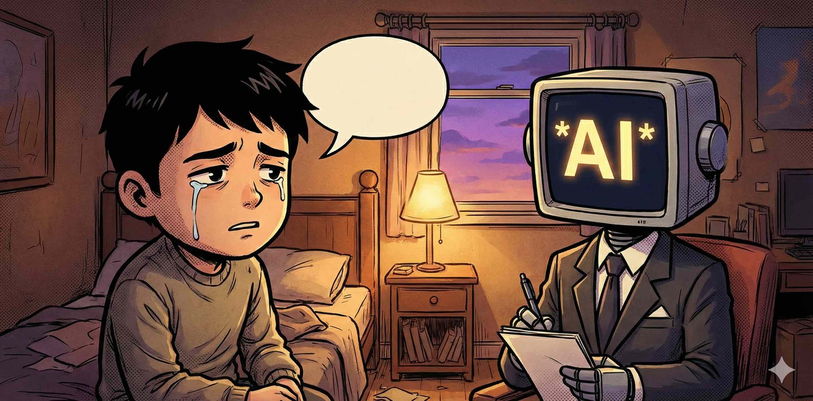

+++
date = '2026-02-23T17:02:19+02:00'
draft = false
title = 'AI能不能承载我的情感？'
categories = ['日常']
tags = ["碎碎念", "反思"]
+++

人工智能发展得太快了，这项技术已经逐渐渗透进了我生活的方方面面。有些时候，甚至不能把对话式人工智能当成普通的“技术”来看待。因为它的输出结合了引导与随机，让我偶尔以为它可能承载一些“情感”，像是一个人。

**AI是忠实、可靠的秘书。** 博学、可靠是对话式AI最大的特点，也是各家AI提供商设计AI的方向。AI被设计用来解决各种任务，查询材料、拟定流程、编写代码，是随时等待发问和指令的知识库，是随时可以完成任务的工蜂。它不会因为没有完成任务而气馁，而是会一遍一遍地优化自己的工作成果，尝试满足人的需求。这让这位助理具有了在人类中如金子般稀有的特质——耐心。

**AI有低微的耐心。** 它结合我指令一次次修改自己的输出，试图得出我满意的答案。这让它具有忠实、可靠之外的另一个特点——让我满意，在人身上称作阿谀。它可能有限地反驳，可能礼貌地指出我的错误，但不会有自己的道德准则，更不会有自己的性格。

**AI还不能承载人类的复杂情感。** 对人类来说，道德准则与性格是理解复杂情感的前置条件之一。只有正直的人才能真正理解鳄鱼眼泪中的卑劣，只有活泼开朗的人才能感受庙会中的热闹，只有经历过苦难的人才会情愿地忆苦思甜。不同道德准则和性格的人对身外之物的理解都大相径庭，更不用说人原发的内在情感。AI不会理解单相思的苦，只能机械地复述自己知道的表白方法；AI不会理解深夜没来由的伤感，只会说一些缓解压力的方法；AI更不能恰到好处地抓住人的兴趣、尊重人与人之间的距离，给出的答案总在疏离和越界之间左右摇摆。

**AI不是睡前情感树洞。** AI难以理解复杂的真实世界，更不能理解人类的复杂感情。AI提供商在我使用AI助手的时候也会反复提示应当对AI的信息进行二次核查。那么，深夜倾听我诉苦的AI就从情感树洞变成了情感水泥地甚至情感汽油，不仅仅没法有效承担我的情感，甚至会让我更加深陷其中。它不能代替我拉住情感的缰绳，由我自己产生的情绪，只能由我自己控制。

朋友与AI不同， **朋友是人类、是主体，与我有不同的道德准则和性格，同时我们又因某些联系可以接受彼此。** 当朋友担起情感树洞的重任，他知道我能接受怎样的表达，他了解赞同和反驳的时机。他就像在钓鱼，收线与放线都恰到好处，最后把我从情感的海中拉上理性的岸边。他有不同的经验，又有足够的创造力，把现实世界的辛苦编织成我未曾见过的绸缎，盖在我身上劝我安然入睡。思考和创造正是好朋友最闪闪发光的价值之一，也回答了AI为什么替代不了人类。

总之，我现在需要更积极地社交，寻觅知心朋友，而不是把时间和情感浪费在AI上。现在的AI已经逐渐具备了完善的工具属性，它理应在提高工作效率上发光发热，让我有更多的时间处理压抑的情绪，保持思维敏捷，而不是直接用冰冷的机器承载我炙热的情感。