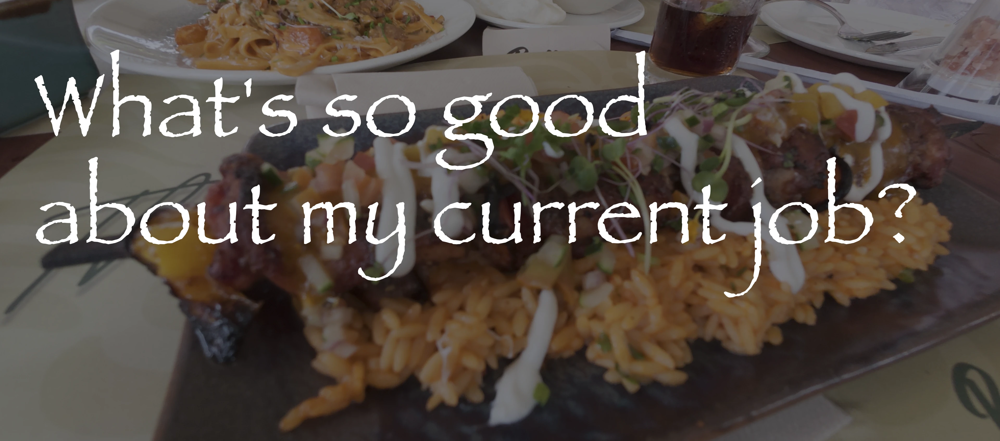

+++
date = '2026-01-23T00:08:40+02:00'
draft = false
title = '我现在的工作哪里好？'
categories = ["日常"]
tags = ["碎碎念", "反思"]
+++

上班一年有余，我频繁抱怨这份与法律没有一点关系、日复一日重复事务性任务的工作。**但抱怨解决不了问题，唯有看清现状、扬长避短，才是进步的开始。**

我曾一直以为，我毕业以后要么是在律所每天加班，要么是在企业的法务岗位和业务部门 battle 。那时最大的期待就是能深入踏足自己感兴趣的领域，从实务中理解法律究竟是如何运行的，如果混一些涉外因素就更好了。法律有“原子性”的特征，不同案件之间不会实际上互相影响，但是其中确定下的规则却一以贯之。这种联系与分离刚刚好与我同频，我希望我的工作和生活也是事事切割干净，但是总体又逻辑严密。可是事与愿违，现在工作中的所有事几乎都连在一起，但是逻辑性又一塌糊涂，就像我的生活，也像这个世界。

不过，这份工作给予了我长期驻外的机会，也让我终于有资格体验全然不同的另一种生活。真正的视野开阔并非走马观花的旅游，而是深度融入一个完全陌生的环境。我第一次直观看到政党竞选口号与民生现状的鸿沟，深刻理解了 LDC 摆脱贫困的艰辛。我第一次真正让英语参与生活，曾经纠结的英语语法、用词在真实生活中退居二线，一件件事终于成了英语生活的主线，语言只不过是一些兴趣点。我第一次确证了我独立生活的能力，从烹饪家务到复杂的人际往来，我发现自己比想象中更具生命力。这种对生活节奏的掌控感，不会让我因碌碌无为而悔恨，是我最大的底气。

在一次吃披萨归来的路上，我被一位当地人叫住，他对我的运动相机展示了浓厚的兴趣，希望我能教他拍视频。我向他展示了运动相机的功能和画质，并向他介绍了一些我录制视频的心得。我意外地发现，我可以很自然地同当地人、陌生人交谈，没有能力不足、也没有社交恐惧、更没有兴奋自卑。那只不过一次普通的交流，却我感觉我在这个方面几近成熟。

驻外环境虽然看似贫瘠，却意外地给了我一个接近理想的 *Work-life-balance* 。实话实说，我只能猜测我同学在国内的生活是怎么样的，我不清楚他们是否正经历刚刚入职时的高强度竞争，但至少这里给了我了不错的报酬与相对合理的业余时间。感谢互联网让我在线下生活如此平淡的赞比亚依然能与世界同频。我将这段时光视作大学生活的延伸，在业余时间制定雄心勃勃的个人计划，并在网络的赋能下不断推进。这种能够摒弃杂念、深度学习的状态，是工作给我极其奢侈的馈赠。

这一年半的驻外时光，已经证明了我在对外经济贸易大学期间积累的底蕴。持续的学习热情让我始终思维开放、保持探索，运用高效的工具让我牢牢掌控自己的生活，强健的体魄让我始终保持面对未知的勇气。这种积极的生活状态是我此前多年不曾有过的，我居然在一年半之内找到了支撑自己的新支点。

两年前，一系列机缘巧合中，我开始学着企业OKR制度做自己的周报和月报，也让我开始严肃的审视自身，更加平和地看待境遇，冷静地抓住转瞬即逝的机遇。现在，不断的反思让我终于有机会让自己从无尽负面情绪中走出来，如果未来有一天我终于回到了法律岗位，这份客观与从容或许真能让我从风险中窥得机遇。
