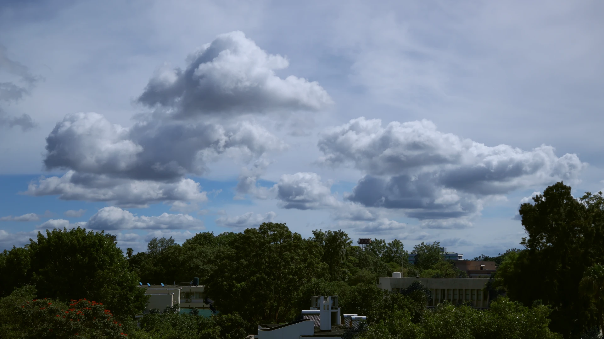

+++
date = '2026-01-19T00:08:43+02:00'
draft = false
title = '我期待的下一段旅行'
categories = ["日常"]
tags = ["碎碎念"]
+++

以前，朋友喊我去外地走走看看，我往往会先应下来，等到临近出发再匆忙决定日程。现在，旅行更像规律生活的负担，前期要费心规划，行程又会打乱日常节奏，我甚至常会埋怨它打断了我的健身计划。我好像真的不那么喜欢出门了。

**我厌倦了城市的人潮与水泥森林，也提不起兴致亲近乡村的泥土与草地**。这种倦怠本不该属于年轻人，尤其是一个还喜欢抱着相机的人。可网络给了我太多窥见奇闻异景的机会，却给真实的世界套上了一层滤镜。那些照片是经过色彩调校的，场景是刻意清场的，就像一颗放久了的鸡蛋 —— 直到打碎才发现，原本期待的 “无菌蛋” 早已变成 “全菌蛋”，只剩满心失望。一次次线下打卡的落差，终究磨掉了我出门的勇气，反倒宁可让现实一直蒙在网络的 “蛋壳” 里。

**我厌倦了千篇一律的游客视角**。自媒体的镜头总藏着意想不到的巧思，而能获得高曝光的照片、视频，又往往是最抓人眼球的那部分。可游客在现场能轻易发现的视角，怎么会出现在抖音推送里？眼光被拔得太高，结果就是现场体验摔得粉碎。明明美景就在眼前，却因 “达不到预期” 而爱而不得，这种遗憾比 “发现照片是为流量刻意打造” 更让人失落，既辜负了眼前的景致，也否定了自己奔赴的意义。

旅行的核心本就是体验，可若抛开走马观花的景观参观，短短几天的行程，又能真正体验到什么？

**我心目中的旅行是感受人**。人终究需要一些社会性，任何性格都需要与人交流。旅行可以创造不同的环境，解锁同一个人的另一面。所以旅行需要伙伴。与热爱摄影的人结伴，两人共同探索未曾见过的视角，新视角只是乐趣的载体。与热爱美食的人同行，食物是否美味可能更显得不重要，面前的油盐酱醋不过是相聚时的谈资。与热爱技术的人通行，两人或许不会过多关心路过的风景，旅行不过是彼此聚首的由头。

**我心目中的旅行是感受真实的生活**。行万里路，本就不该是走马观花，快餐式的打卡只是填饱了肚子，没有营养、更无特色。花几天时间在街上漫无目的地走，更是徒劳，好比刚吃了餐前冷盘就匆匆离席，满是遗憾。真正的感受生活，是走到当地人中间，像天津大爷一样纵身跳水，在武汉早高峰来临前嗦一碗热干面，在山西亲手和面团、擀一碗地道的面。这些体验组成了行万里路的内核，它给你足够的时间，去读每一件展品而非穿过博物馆，去认识几个朋友而非擦肩而过，去与当地的街头巷尾互动而非仅仅留个脚印。

下一段旅行，我要的不过是合拍的伙伴与从容的时间。不必追赶打卡清单，不用迁就匆匆日程。和合拍的人一起，在陌生的街巷慢慢逛，于烟火小店歇歇脚，让风景自然闯入视线，让故事悄悄发生。这一次，旅行不再是负担，而是心灵的归处，是日子里最温柔的留白。

P.S. *感觉现在的写作水平可能还不如高中了，原来任何能力都需要持续练习*