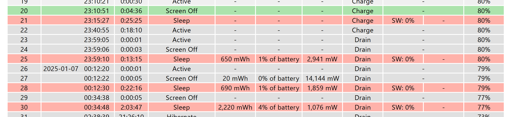
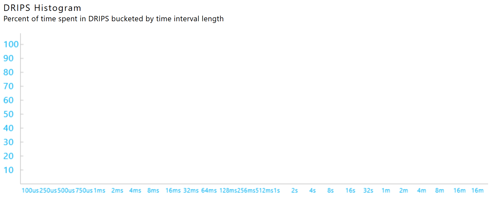
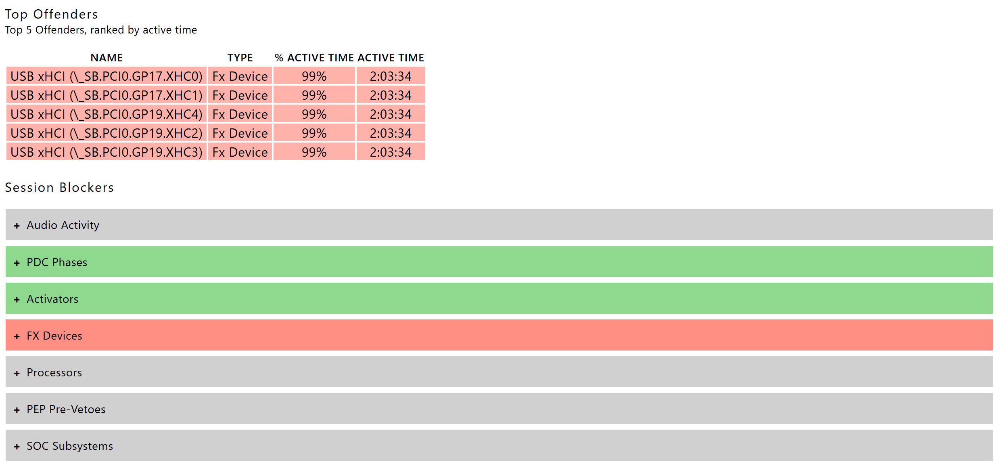
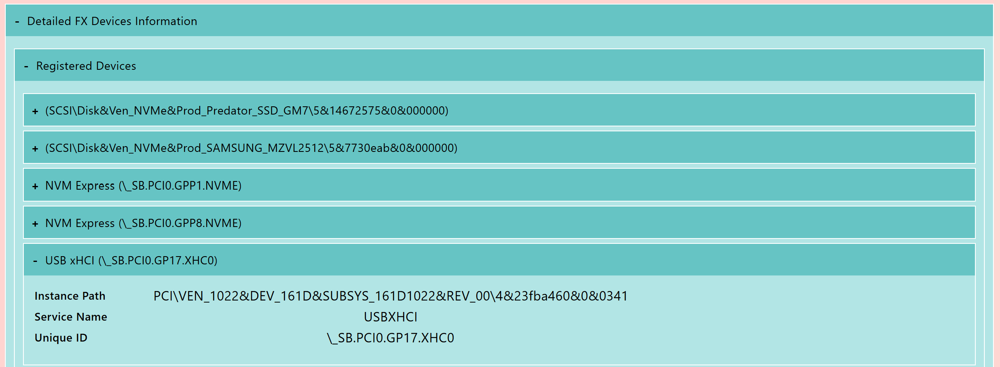
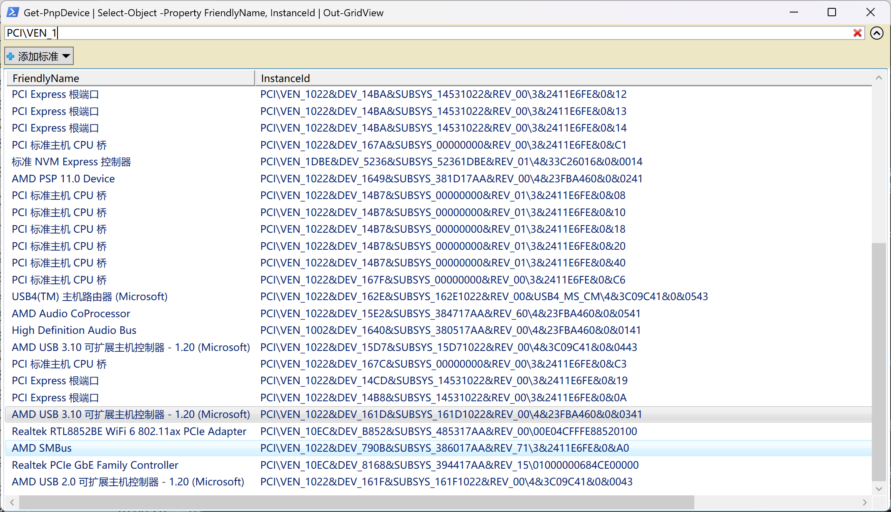
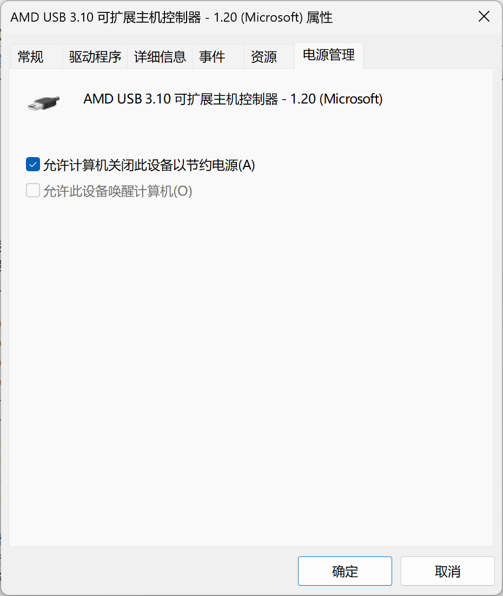
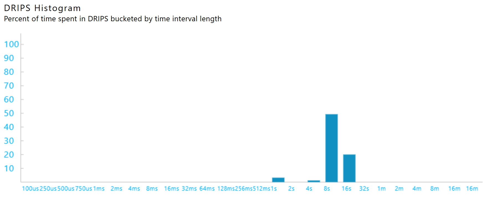
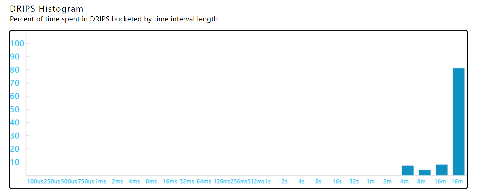

+++
date = '2025-01-29T23:52:32+08:00'
draft = false
title = '折腾Windows睡眠功能实录'
categories = ["技术"]
tags = ["操作系统", "Windows", "电源"]
+++

## 前言
看了好多好多网上的调教Windows睡眠功能的视频和帖子，没有一个能解决问题，提出的解决方案也都没有给出一个所以然。[Linus](https://www.bilibili.com/video/BV1Pv4y1d7Ms/?share_source=copy_web&vd_source=fb265942059a9ab2a1e9aaac585a4d43)和[差评君](https://www.bilibili.com/video/BV1k46GY5Eg1/?share_source=copy_web&vd_source=fb265942059a9ab2a1e9aaac585a4d43)通过反复测试的方法尝试寻找睡眠睡死、突然唤醒和“失眠”的规律，这也是我之前的寻找路径，但是反复测试需要的测试量过大，考虑的变量过多。全部测试出来实在不是很现实，不同的人的笔记本又有不同的情况，不讨论原理的话很难在其他人的电脑上复现，所以本文意在授人以渔。

如网上的好多方案一样，我也只是提供我笔记本的情况，以及对应的**看似成功了**的解决方案。希望能提供一些帮助。
## 问题
### 系统信息
这是一台新安装系统的Thinkbook 14+ ARA笔记本，无独显，处理器是[AMD Ryzen 6800H](https://www.amd.com/en/support/downloads/drivers.html/processors/ryzen/ryzen-6000-series/amd-ryzen-7-6800h.html)。系统信息如下

``` text
设备名称	HIDE-SEEK
处理器	AMD Ryzen 7 6800H with Radeon Graphics            3.20 GHz
机带 RAM	32.0 GB (27.7 GB 可用)
...
系统类型	64 位操作系统, 基于 x64 的处理器
笔和触控	没有可用于此显示器的笔或触控输入

版本	Windows 11 家庭中文版
版本号	24H2
安装日期	‎2024/‎12/‎22
操作系统版本	26100.2605
体验	Windows 功能体验包 1000.26100.36.0
```
### 问题描述
进入睡眠以后掉电很快，没多久就因为耗电过多（4%）触发休眠门槛，导致系统休眠（hibernate）到硬盘。睡眠时，键盘灯亮，电源灯不呼吸，但是大小写锁定灯和FN锁定灯熄灭。

## 测试方案

按`win + x`和`a`打开管理员终端，输入 `powercfg /systempowerreport` 生成系统的电池报告，电池报告会生成在`%HOME%`目录下



发现在键盘灯点亮期间，系统电源状态是sleep，系统已经进入睡眠状态。进一步分析报告，发现软件的*Low Power State Time*是0%，同时DRIPS的统计时间中没有数据。说明由于软件的某些影响，系统整体没能进入低功耗的状态。



根据微软现代待机的[文档](https://learn.microsoft.com/en-us/windows-hardware/design/device-experiences/modern-standby-sleepstudy-common-problem-examples#no-software-drips-or-hardware-drips-due-to-a-missing-driver)，这可能是由于该硬件、或软件缺乏合适的驱动程序导致的。电池报告在下方列出了5个在本次睡眠中最活跃的5个设备。可以在被标记为红色*session blocker*中进一步查看被标记为高耗能的设备。



可以看到，这些设备的活跃时间在90%以上，这是显然是不正常的，符合微软文档中设备异常活跃的描述。因此，需要找到该设备ID对应的设备是什么，去设备管理器中更新或重新安装驱动程序，并检查该设备是否存在其他问题。

向下继续翻电池报告，可以在*Detailed FX Devices Information*节中，找到每个设备ID对应的位置。



使用下面的代码定位设备的名称

``` pwsh
Get-PnpDevice | Select-Object -Property FriendlyName, InstanceId | Out-GridView
```



在弹出的窗口中搜索对应的设备位置，搜索即可找到对应的设备在设备管理器中的名字，在设备管理器中找到设备，尝试选择自动更新驱动程序。

在我的案例中，我发现是AMD的USB控制器和其下的USB集线器过于活跃，这些设备的驱动可能本身不含现代待机要求的[*low-power idle states*](https://learn.microsoft.com/en-us/windows-hardware/design/device-experiences/directed-power-management)，我额外检查了对应设备的电源管理设置，发现*允许计算机关闭此设备以节约电源*选项未勾选。我推测可能是因为系统无法以直接关闭设备的方式停止该设备活动，所以该设备活跃时间畸高。因此，勾选该项再次测试，发现系统可以正常进入睡眠，键盘灯正常熄灭。



此外，在后期的测试过程中，还会出现个别程序长时间占用音频流（但不发出声音，因此难以察觉，可以使用`powercfg /requests`查看是否存在这种情况）导致的“高功耗”睡眠的情况，在系统电源报告中也有体现，可以直接寻找红色的电源记录检查是否存在问题。

之后，睡眠期间耗电高的问题**成功解决**。

如果上述方案仍难以解决问题，可以考虑使用[Windows性能分析器](https://learn.microsoft.com/en-us/windows-hardware/design/device-experiences/using-windows-performance-analyzer-to-analyze-modern-standby-issues#capture-and-view-a-wpa-trace-for-modern-standby-diagnostics)进一步确定问题。

## 现代待机

[现代待机](https://learn.microsoft.com/en-us/windows-hardware/design/device-experiences/modern-standby)是微软在Windows上退出的*新*的待机机制，实际上Windows已经使用了该机制10年以上，也算是经过了一些检验。根据微软的[描述](https://learn.microsoft.com/en-us/windows-hardware/design/device-experiences/modern-standby-vs-s3)，相比传统s3待机，现代待机有以下几个优势：

- 迅速恢复：可以在1s内恢复工作
- 睡眠期间保持后台活动
- 无需与bios互动，仅需简单的硬件中断即可实现睡眠

Windows在使用电源和电池时的现代待机策略时不同的，以下两图反映了计算机在插入交流电源（上图）和使用电池（下图）时的系统被从DRIPS状态中唤醒时间间隔的不同。




我选择了比较典型的情况，在上述对比中，使用交流电源时DRIPS状态的中断更加频繁，大部分DRIPS状态的持续时段在8-16s之间，而使用电池时DRIPS状态的持续时段大多数在16mins以上。根据我的经验，当在睡眠期间移除和接入交流电源，会使电脑短暂唤醒，然后重新进入睡眠状态。Windows可能在这期间调整电源使用策略。

Windows在处理因超时进入睡眠和因用户操作（如电源按钮、关闭笔记本盖子等）进入睡眠的策略也是不同的。如果系统达到设定的空闲时间，系统会先关闭屏幕，再在设定的超时达到后，进入睡眠。 **（如果有音频占用，系统保持关闭屏幕状态，不会进入睡眠，直到因用户操作进入睡眠）** 如果用户做出进入睡眠的操作，Windows会暂停音频流，关闭屏幕的同时进入睡眠。

## 参考文献

- [What is Modern Standby](https://learn.microsoft.com/en-us/windows-hardware/design/device-experiences/modern-standby)
- [Modern Standby vs S3](https://learn.microsoft.com/en-us/windows-hardware/design/device-experiences/modern-standby-vs-s3)
- [Directed power management](https://learn.microsoft.com/en-us/windows-hardware/design/device-experiences/directed-power-management)
- [Modern Standby Basic Test Scenarios](https://learn.microsoft.com/en-us/windows-hardware/design/device-experiences/modern-standby-basic-test-scenarios)
- [Modern Standby FAQs](https://learn.microsoft.com/en-us/windows-hardware/design/device-experiences/modern-standby-faqs?source=recommendations)
